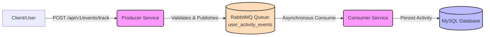

# Event-Driven User Activity Tracking System

A reliable, scalable event-driven tracking system built with Spring Boot, RabbitMQ, and MySQL. This project demonstrates synchronous REST API ingestion decoupled from asynchronous database persistence using a message broker.

## System Architecture

The architecture follows a classic event-driven Publish-Subscribe pattern.



### Components

- **Producer Service** (Port 8000): A Spring Boot REST API that accepts incoming `UserActivityEvent` payloads, validates the data, and publishes the event to RabbitMQ. It returns a fast `202 Accepted` response without waiting for database operations.
- **Consumer Service** (Port 8001): A Spring Boot worker service that continuously listens to the `user_activity_events` queue. It deserializes incoming messages and reliably saves them to MySQL.
- **RabbitMQ**: The message broker used to decouple the producer from the consumer, ensuring high availability and buffering of burst traffic.
- **MySQL**: Relational database for persistent storage of user activities.

---

## Process of Implementation

1. **System Design & Setup**:
   - Defined the JSON schema for `UserActivityEvent` containing `user_id`, `event_type`, `timestamp`, and flexible `metadata`.
   - Setup a `docker-compose.yml` defining the infrastructure (MySQL, RabbitMQ) and the Spring Boot services.
2. **Producer API Development**:
   - Implemented `POST /api/v1/events/track` endpoint.
   - Added robust `@Valid` annotations and a `@ControllerAdvice` (`GlobalExceptionHandler`) to trap bad requests and return structured `400 Bad Request` responses.
3. **Consumer Worker Development**:
   - Created an `@RabbitListener` to process messages asynchronously.
   - Implemented JPA Entities and Repositories to sink the JSON events into the `user_activities` SQL table.
   - Configured Spring AMQP retry mechanisms to trap transient database failures and ensure no messages are lost.
4. **Resilience & Orchestration**:
   - Mapped health checks (`/health`) so Docker Compose can coordinate startup dependency conditions (e.g., consumer waits for MySQL and RabbitMQ to be healthy before booting).
   - Moved all secrets and configuration into abstract environment variables loaded via `.env`.

---

## Prerequisites

- Docker and Docker Compose installed and running.

## Setup & Quick Start

1. **Environment Configuration**: Create your own `.env` file at the root of the project with secure credentials:

   ```bash
   cp .env.example .env
   # Update the values inside .env as appropriate
   ```

2. **Build and Deploy**:
   From the root directory of the project, run:

   ```bash
   docker-compose up -d --build
   ```

   > Note: Wait approx 30 seconds for RabbitMQ and MySQL to become fully ready before the services finish initializing themselves.

3. **Verify Health**:
   Both services expose an Actuator health endpoint at `/health` (configured via `management.endpoints.web.base-path=/`).
   - Producer: `http://localhost:8000/health`
   - Consumer: `http://localhost:8001/health`

## Usage

Send a test event payload to the Producer Service API:

```bash
curl -X POST \
  -H "Content-Type: application/json" \
  -d '{
    "user_id": 123,
    "event_type": "login",
    "timestamp": "2026-02-19T10:00:00",
    "metadata": {"browser": "Chrome", "ip": "192.168.1.1"}
  }' \
  http://localhost:8000/api/v1/events/track
```

### Checking Data Persistence

After a 202 Accepted response, verify the consumer saved the activity to the database:

```bash
docker exec -it <mysql_container_name> mysql -u <your_mysql_user> -p<your_mysql_password> -D user_activity_db
```

```sql
SELECT * FROM user_activities;
```

## Resilience & Error Handling

- **Malformed Payloads**: The producer catches invalid schema items and produces a well-structured `400 Bad Request` with `details` containing the precise validation failures.
- **Message Retry**: The consumer relies on Spring AMQP simple retry mechanisms to retry transient failures before eventually throwing, preventing silent data skipping on temporary DB faults.
